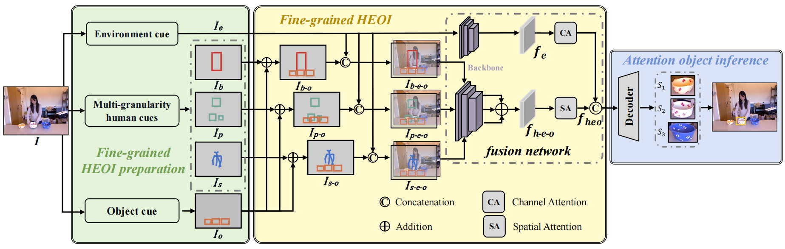

<h2 align="center">
  <a href="https://ieeexplore.ieee.org/abstract/document/10794598">
    HEOI: Human Attention Prediction in Natural Daily Life with Fine-Grained Human-Environment-Object Interaction Model
  </a>
</h2>
<h4 align="center" color="A0A0A0"> Zhixiong Nan, Leiyu Jia, Bin Xiao* </h4>
<h5 align="center"> If you like our project, please give us a star ⭐ on GitHub for the latest update.</h5>

# HEOI
This is the official implementation of the paper "[HEOI: Human Attention Preiction in Natural Daily Life with Fine-Grained Human-Environment-Object Interaction Model](https://ieeexplore.ieee.org/abstract/document/10794598)".

<div align="center">
  
</div><br/>

This paper handles the problem of human attention prediction in natural daily life from the third-person view. Due to the significance of this topic in various applications, researchers in the computer vision community have proposed many excellent models in the past few decades, and many models have begun to focus on natural daily life scenarios in recent years. However, existing mainstream models usually ignore a basic fact that human attention is a typical interdisciplinary concept. Specifically, the mainstream definition is direction-level or pixel-level, while many interdisciplinary studies argue the object-level definition. Additionally, the mainstream model structure converges to the dual-pathway architecture or its variants, while the majority of interdisciplinary studies claim attention is involved in the human-environment interaction procedure. Grounded on solid theories and studies in interdisciplinary fields including computer vision, cognition, neuroscience, psychology, and philosophy, this paper proposes a fine-grained Human-Environment-Object Interaction **HEOI** model, which for the first time integrates multi-granularity human cues to predict human attention. Our model is explainable and lightweight, and validated to be effective by a wide range of comparison, ablation, and visualization experiments on two public datasets.

## Update
[2025/3] Code for [HEOI](https://github.com/CQU-ADHRI-Lab/HEOI) is available here!

[2024/11] HEOI has been accepted at TIP as a regular paper!

## Installation

We tested our code with `Python=3.9.19, PyTorch=1.13.0, CUDA=11.4`. Please install PyTorch first according to [official instructions](https://pytorch.org/get-started/previous-versions/).

Example conda environment setup：

```bash
# Create a new virtual environment
conda create -n heoi python=3.9 -y
conda activate heoi

# Install PyTorch
pip install torch==1.13.0+cu117 torchvision==0.14.0+cu117 --extra-index-url https://download.pytorch.org/whl/cu117

# Under your working directory
git clone https://github.com/CQU-ADHRI-Lab/HEOI.git
cd HEOI/
pip install -r requirements.txt
```

## Run
### Dataset
We provide attention object annotations for <a href="https://drive.google.com/drive/folders/1_ExuT3rxAk6fC_aY-uM_L7eHMqd3__N5?usp=sharing" target="_blank">CAD-120</a> dataset.


### Training

Train HEOI with 2 GPUs:

```sh
CUDA_VISIBLE_DEVICES=0,1 python train.py --name CAD_DenseFusion_V1_B_200_LR0001 --model_name Dense_V1 --network_name Dense_fusion_V1 --batch_size 200 --lr_G 0.0001 --nepochs_decay 5 --nepochs_no_decay 5
```

### Evaluation

You can download our pretrained models and evaluate them with the following commands. 
```sh
CUDA_VISIBLE_DEVICES=0,1 python test_CAD_netpart.py --name CAD_DenseFusion_V1_B_200_LR0001 --model_name Dense_V1 --network_name Dense_fusion_V1 --batch_size 200 --lr_G 0.0001 --nepochs_decay 5 --nepochs_no_decay 5
```
### Checkpoints
We provide checkpoints for <a href="https://drive.google.com/file/d/1so-3t07-v0rn1zQ5S2wOrD2K30lbd6IS/view?usp=sharing" target="_blank">CAD-120</a> dataset.


## <a name="CitingMIDETR"></a>Citing HEOI

If you find our work helpful for your research, please consider citing the following BibTeX entry.

```BibTeX
@article{nan2024heoi,
  title={HEOI: Human Attention Prediction in Natural Daily Life With Fine-Grained Human-Environment-Object Interaction Model},
  author={Nan, Zhixiong and Jia, Leiyu and Xiao, Bin},
  journal={IEEE Transactions on Image Processing},
  year={2024}
}
```
```BibTex
@article{nan2023third,
  title={Third-person view attention prediction in natural scenarios with weak information dependency and human-scene interaction mechanism},
  author={Nan, Zhixiong and Xiang, Tao},
  journal={IEEE Transactions on Circuits and Systems for Video Technology},
  year={2023},
  publisher={IEEE}
}
```
```BibTex
@article{nan2021predicting,
  title={Predicting task-driven attention via integrating bottom-up stimulus and top-down guidance},
  author={Nan, Zhixiong and Jiang, Jingjing and Gao, Xiaofeng and Zhou, Sanping and Zuo, Weiliang and Wei, Ping and Zheng, Nanning},
  journal={IEEE Transactions on Image Processing},
  volume={30},
  pages={8293--8305},
  year={2021},
  publisher={IEEE}
}
```
```BibTex
@article{nan2020learning,
  title={Learning to infer human attention in daily activities},
  author={Nan, Zhixiong and Shu, Tianmin and Gong, Ran and Wang, Shu and Wei, Ping and Zhu, Song-Chun and Zheng, Nanning},
  journal={Pattern Recognition},
  volume={103},
  pages={107314},
  year={2020},
  publisher={Elsevier}
}
```
